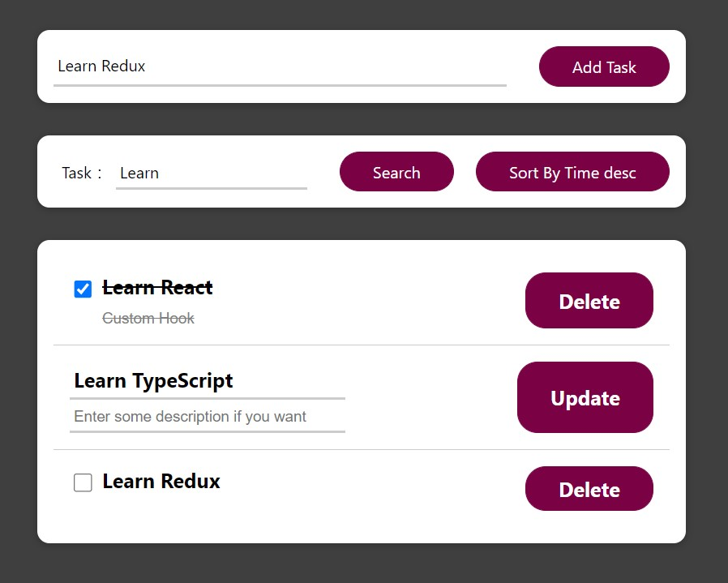

# Getting Started with Todo List App

This project was bootstrapped with [Create React App](https://github.com/facebook/create-react-app).

## 前置環境

- git(optional)
- node.js
- yarn (optional)

## 啟動流程

1. git clone https://github.com/kuanchungfeng/todo-list-app.git(or download zip and extract it)
2. ### `npm install` or `yarn install`
3. ### `npm start` or `yarn start`
4. Open [http://localhost:3000](http://localhost:3000) to view it in the browser.

## 欄位說明

| 欄位名稱    | 類型    | 備註                 |
| ----------- | ------- | -------------------- |
| id          | string  |                      |
| title       | string  | 每個 task 的主要內容 |
| description | string  | 補充說明 task        |
| completed   | boolean | 是否完成             |
| createTime  | Date    | 建立時間             |
| editable    | boolean | 是否可編輯           |

## 功能介紹

- btn:[Add Task]:新增一個任務

- btn:[Search]:依據前面 Input 進行**模糊**查詢，將查詢結果顯示在底下列表上。
- btn:[Sort By Time desc/asc]:點擊後更改底下列表，依照時間升/降冪排序
- btn:[Update]:更改某一筆的 Task，及其 Description
- btn:[Delete]:刪除某一筆 Task
- input : 每個 input，按 Enter 都會觸發輸入完成的功能(新增/查詢/修改)
- checkbox: 更改某一筆 Task 為完成/未完成，畫線的為完成的 Task
- checkbox 後面的 Task **Double Click** 可以切換成編輯模式

## Codebase Architecture

- Framework：React + Function Component + Hook
- Language：Typescript

- Style：Module CSS + Bootstrap

- State：React Context

<!-- - 測試：Jest + React Test Library -->
